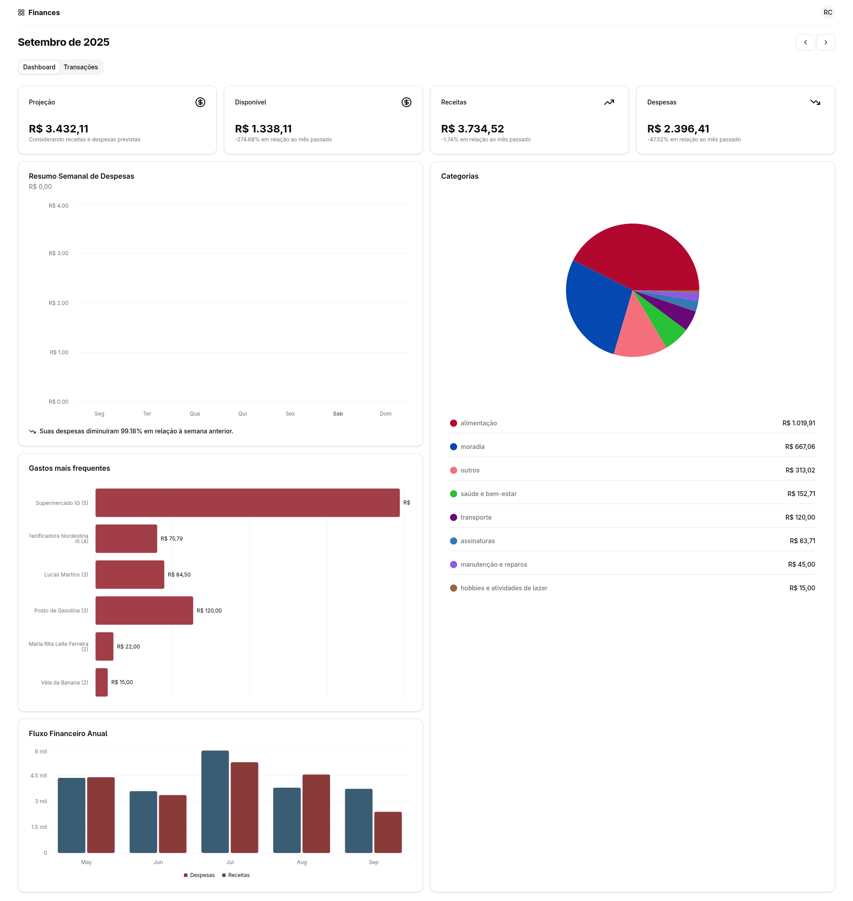
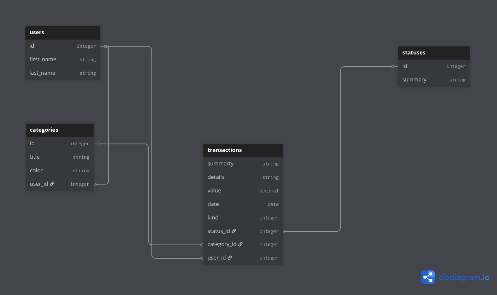

<div align="center">

  # Finances

  Finances é uma aplicação moderna de gestão financeira pessoal que oferece controle completo sobre receitas e despesas através de dashboards visuais, análises comparativas e categorização de gastos.

&nbsp;
&nbsp;
&nbsp;
&nbsp;

</p>

  
</div>

<p>A plataforma resolve o problema de falta de visibilidade financeira, transformando transações em insights. Com recursos como edição em lote, filtros avançados, gráficos interativos e indicadores de tendência, você identifica rapidamente padrões de consumo, maiores gastos e evolução dos seus hábitos financeiros ao longo do tempo.</p>

### Funcionalidades

Dashboard Analítico
- Métricas financeiras em tempo real (projeção, disponível, receitas e despesas)
- Comparativos mensais com indicadores de tendência
- Gráfico de fluxo de caixa anual (últimos 6 meses)
- Análise de despesas semanais por dia
- Distribuição de gastos por categoria (gráfico de pizza)
- Ranking de gastos mais frequentes

Gestão de Transações
- Cadastro único ou em lote de receitas e despesas
- Edição individual ou múltipla de transações
- Exclusão individual ou em massa
- Filtros por descrição, categoria, status e período
- Navegação por mês/ano com histórico completo
- Categorização com cores personalizadas
- Controle de status (pago/recebido/pendente)

Visualização de Dados
- Agrupamento de transações por data
- Totalizadores automáticos por período
- Gráficos interativos (barras, pizza, linha)
- Interface responsiva para desktop e mobile

### Funcionalidades Futuras
- Planejamento do Fluxo de Transações Mensais (entradas e saídas)
- Cadastro de Categorias
- Autenticação

### Tecnologias Utilizadas

### Backend
- **Ruby on Rails 8.0.2**
- **Ruby 3.4.2**
- **PostgreSQL**
- **Docker**

### Frontend
- **React 19.1.2**
- **TypeScript 5.8.3**
- **Vite 6.3.5**
- **Tailwind CSS + Shadcn UI**

<h3>Como Executar</h3>

### Pré-requisitos
- Docker, Docker Compose
- Node.js 18+
- Ruby 3.4.1

### Rodando com Docker Compose

#### Clone o repositório

```bash
git clone git@github.com:robmacav/finances.git
```

#### Suba os containers
```bash
docker-compose up -d
```

#### Acesse
- API: http://localhost:3000
- Web: http://localhost:5173

### Competências Técnicas

**Backend:** Ruby on Rails • RESTful API • PostgreSQL • MVC Pattern • Presenters • Concerns • API Versioning • Namespacing

**Frontend:** React • TypeScript • Vite • Custom Hooks • State Management • Component Architecture • CSS Modules

**Bibliotecas:** Recharts • TanStack Table • shadcn/ui

**Conceitos:** Clean Code • CRUD Operations • Batch Processing • Data Visualization • Responsive Design • Separation of Concerns • Single Responsibility Principle

**DevOps:** Docker • Docker Compose • Git

<br>

<details>
<summary style="font-size:18x;">🗄️ Modelagem da Base de Dados</summary>

<br>



</details>

<br>

<details>
<summary style="font-size:18x;">Estrutura do Projeto</summary>

<br>

```
    ├── 🔴 api/ 
    │   ├── 📂 app/
    │   │   ├── 📂 controllers/
    │   │   │   ├── 📂 v1/
    │   │   │   │   ├── 📂 reports/
    │   │   │   │   │   ├── 💎 dashboard_controller.rb
    │   │   │   │   │   └── 💎 transactions_controller.rb
    │   │   │   │   ├── 📂 utils/
    │   │   │   │   │   └── 💎 transactions_controller.rb
    │   │   │   │   └── 💎 transactions_controller.rb
    │   │   │   └── 💎 application_controller.rb
    │   │   ├── 📂 models/
    │   │   │   ├── 📂 concerns/
    │   │   │   │   └── 💎 currency_formatable.rb
    │   │   │   ├── 💎 application_record.rb
    │   │   │   ├── 💎 category.rb
    │   │   │   ├── 💎 status.rb
    │   │   │   ├── 💎 transaction.rb
    │   │   │   └── 💎 user.rb
    │   │   └── 📂 presenters/
    │   │       └── 💎 transaction_presenter.rb
    │   ├── 🐳 Dockerfile
    │   └── 🐚 entrypoint.sh
    │
    ├── 🔵 web/
    │   ├── 📂 src/
    │   │   ├── 📂 api/
    │   │   │   ├── 📂 reports/
    │   │   │   │   ├── 📂 dashboard/
    │   │   │   │   │   └── 📘 fetchData.ts
    │   │   │   │   └── 📂 transactions/
    │   │   │   │       └── 📘 fetchByMonthYear.ts
    │   │   │   ├── 📂 utils/
    │   │   │   │   └── 📂 transactions/
    │   │   │   │       └── 📘 formDataFetch.ts
    │   │   │   └── 📘 transaction.ts
    │   │   ├── 📂 app/
    │   │   │   ├── 📂 pages/
    │   │   │   │   ├── 📂 dashboard/
    │   │   │   │   │   ├── ⚛️ AnnualCashFlowOverview.tsx
    │   │   │   │   │   ├── ⚛️ ExpensesByCategoryOverview.tsx
    │   │   │   │   │   ├── ⚛️ Index.tsx
    │   │   │   │   │   ├── ⚛️ KeyMetrics.tsx
    │   │   │   │   │   ├── ⚛️ MostFrequentExpensesOverview.tsx
    │   │   │   │   │   └── ⚛️ WeeklyExpensesOverview.tsx
    │   │   │   │   └── 📂 transactions/
    │   │   │   │       ├── 📂 dialogs/
    │   │   │   │       │   ├── ⚛️ DeleteDialog.tsx
    │   │   │   │       │   ├── ⚛️ DeleteMultiplesDialog.tsx
    │   │   │   │       │   ├── ⚛️ EditDialog.tsx
    │   │   │   │       │   ├── ⚛️ EditMultiplesDialog.tsx
    │   │   │   │       │   ├── ⚛️ FilterDialog.tsx
    │   │   │   │       │   ├── ⚛️ NewDialog.tsx
    │   │   │   │       │   └── ⚛️ ShowDialog.tsx
    │   │   │   │       ├── ⚛️ DataTablePagination.tsx
    │   │   │   │       ├── ⚛️ Index.tsx
    │   │   │   │       ├── ⚛️ MonthYearPickerOnly.tsx
    │   │   │   │       └── ⚛️ getColumns.tsx
    │   │   │   ├── ⚛️ MonthlyNavigation.tsx
    │   │   │   ├── ⚛️ ProfileDropdown.tsx
    │   │   │   └── ⚛️ SiteHeader.tsx
    │   │   ├── 📂 hooks/
    │   │   │   ├── 📂 reports/
    │   │   │   │   ├── 📂 dashboard/
    │   │   │   │   │   └── 📘 useData.ts
    │   │   │   │   └── 📘 useTransactionsByMonthYear.ts
    │   │   │   ├── 📂 utils/
    │   │   │   │   └── 💰 transactions/
    │   │   │   │       └── 📘 useFormData.ts
    │   │   │   └── 📘 use-mobile.ts
    │   │   ├── 📂 lib/
    │   │   │   ├── 📘 api.ts
    │   │   │   └── 📘 utils.ts
    │   │   ├── ⚛️ App.tsx
    │   │   ├── ⚛️ main.tsx
    │   ├── 📂 types/
    │   │   └── 📂 reports/
    │   │       ├── 📘 DashboardData.ts
    │   │       └── 📘 Transaction.ts
    │   ├── 🌐 index.html
    │
    ├── 🐳 docker-compose.yml
```
</details>
