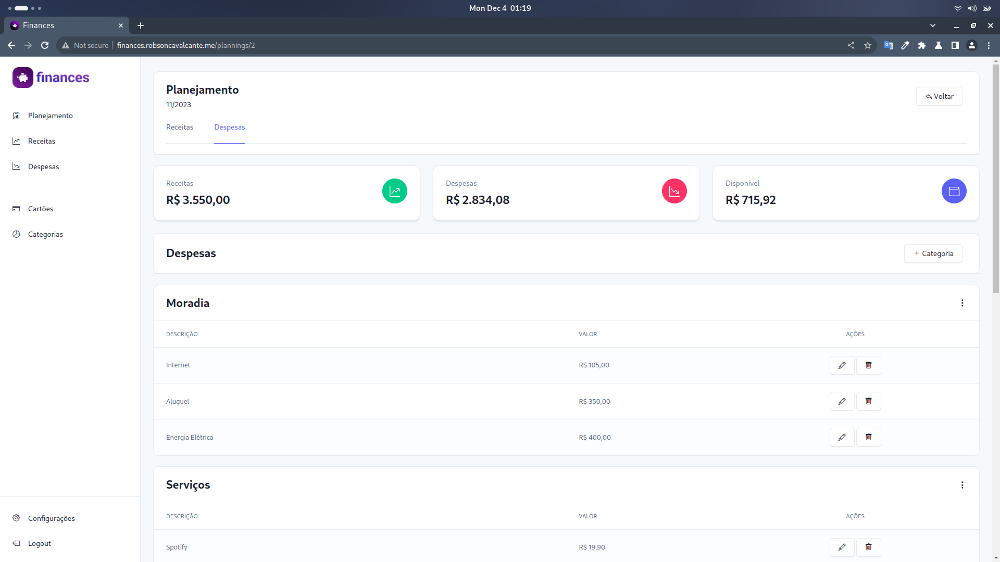

<div align="center">

  # Financial Manager

  An application to manage finances.

&nbsp;
&nbsp;
&nbsp;
&nbsp;
&nbsp;

</p>

  
  <!--  -->
</div>

## Features
- Income planning and expense categorization.
- Registration of revenues over the months and years.
- Record of expenses + payment method.
- Card registration.
- Monthly balance of expenses, income and available credit and cash limits.

## How to Run
```bash
docker build -f Dockerfile.dev -t finances_app_dev .
```
```bash
docker run -p 3000:3000 -v .:/app finances_app_dev
```
