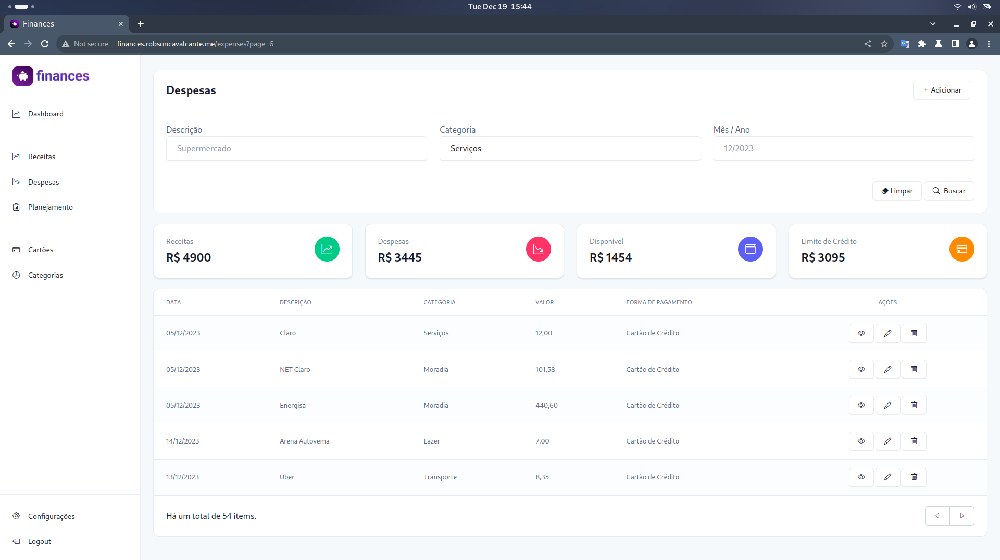

<div align="center">

  # Financial Manager

  An application to manage finances.

&nbsp;
&nbsp;
&nbsp;

</p>

  
  <!--  -->
</div>

## How to Run
```bash
docker compose -f docker-compose.dev.yml up
```

Or, if you prefer, you can explore the system's functionalities using these access credentials:
- `explorer@finances.me`
- `123456`

## Documentation
Access the <a href="https://robmacav.github.io/finances" target="_blank">documentation</a> for this project.
